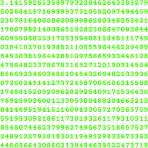

<div align="center">
<h1>million digits of pi</h1>

samarth kulshrestha


<br>


<br/><br/><br/>

<br/><br>
</div>

## Introduction

**million_digits_of_pi** is a minimal C++ program that can compute $\pi$ and $e$
(euler's constant) to millions of digits in a quasi-linear runtime using Fast
Fourier Tranforms ([FFT](https://en.wikipedia.org/wiki/Fast_Fourier_transform))
and the [Chudnovsky Algorithm](https://en.wikipedia.org/wiki/Chudnovsky_algorithm).

## Algorithms implemented:

#### FFT-Based Multiplication (Schönhage–Strassen algorithm)


#### Newton's Method
Newton's method, also known as the Newton–Raphson method, named after Isaac
Newton and Joseph Raphson, is a root-finding algorithm which produces
successively better approximations to the roots (or zeroes) of a real-valued
function.

```math
r_1 = r_0 - \left(\frac{r_0\:^2\cdot{x-1}}{2}\right)\times{r_0}
```

<div align="center">

</div>

#### Binary Splitting

#### Log Factorial Approximation
Returns a very good approximation of $log(x!)$. This approximation gets better
as $x$ gets larger.

```math
log(x!) \approx \frac{\left(x + \frac{1}{2}\right) \times \left(log(x) - 1\right) + \left(log(2\pi) + 1\right)}{2}
```
