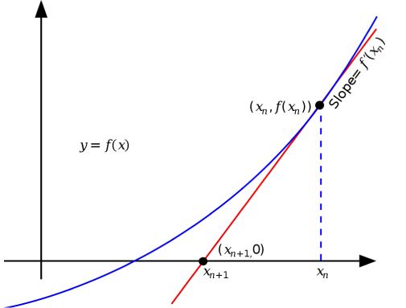

<div align="center">
<h1>million digits of pi</h1>

samarth kulshrestha


<br>


<br/><br/><br/>

<br/><br>
</div>

## Introduction

**million_digits_of_pi** is a minimal C++ program that can compute $\pi$ and $e$
(euler's constant) to millions of digits in a quasi-linear runtime using Fast
Fourier Tranforms ([FFT](https://en.wikipedia.org/wiki/Fast_Fourier_transform))
and the [Chudnovsky Algorithm](https://en.wikipedia.org/wiki/Chudnovsky_algorithm).

## Algorithms implemented:

#### FFT-Based Multiplication (Schönhage–Strassen algorithm)
The [Schönhage–Strassen](https://en.wikipedia.org/wiki/Sch%C3%B6nhage%E2%80%93Strassen_algorithm)
algorithm is an asymptotically fast multiplication algorithm for large integers.
It works by recursively applying number-theoretic transforms
(a form of fast Fourier transform) over the integers modulo $2^n+1$.
The run-time bit complexity to multiply two n-digit numbers using the algorithm
is $O(n\cdot \log n\cdot \log \log n)$ in big O notation.


#### Newton's Method
Newton's method, also known as the Newton–Raphson method, named after Isaac
Newton and Joseph Raphson, is a root-finding algorithm which produces
successively better approximations to the roots (or zeroes) of a real-valued
function.

```math
r_1 = r_0 - \left(\frac{r_0\:^2\cdot{x-1}}{2}\right)\times{r_0}
```
<br/>
<br/>
<div align="center">

</div>

#### Binary Splitting
In mathematics, binary splitting is a technique for speeding up numerical
evaluation of many types of series with rational terms. In particular, it can
be used to evaluate hypergeometric series at rational points.

Given a series
```math
\displaystyle{S(a,b) = \sum_{n=a}^{b} \frac{p_n}{q_n}}
```
where $p_n$ & $q_n$ are integers, the goal of binary splitting is to compute
integers $P(a,b)$ and $Q(a,b)$ such that
```math
\displaystyle{S(a,b) = \frac{P(a,b)}{Q(a,b)}}
```
.

#### Log Factorial Approximation
Returns a very good approximation of $log(x!)$. This approximation gets better
as $x$ gets larger.

```math
log(x!) \approx \frac{\left(x + \frac{1}{2}\right) \times \left(log(x) - 1\right) + \left(log(2\pi) + 1\right)}{2}
```
